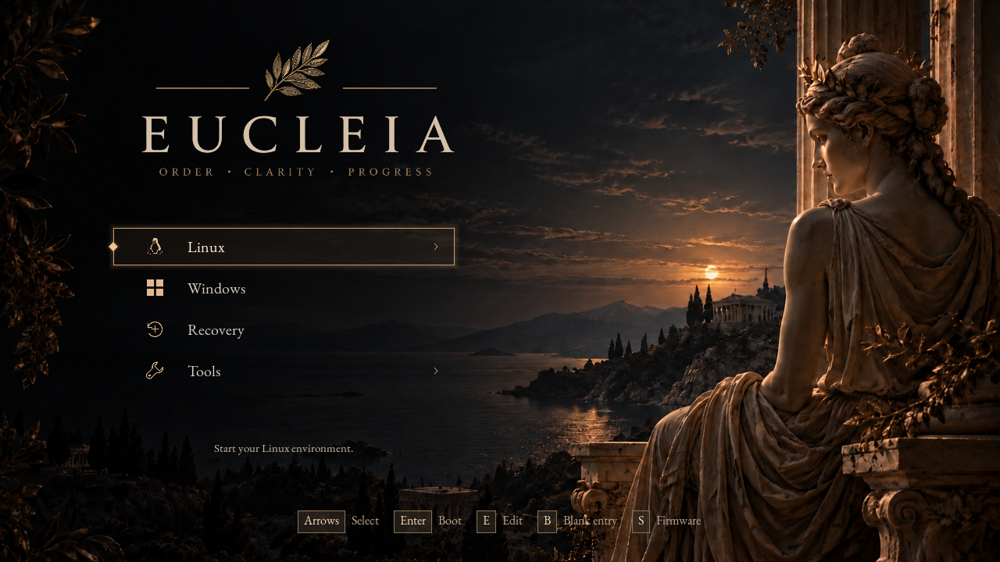

# Limine-Eucleia

Limine-Eucleia is a graphical boot-menu fork of Limine, based on upstream
v12.9.0. It adds configurable layout, native FreeType text, PNG headers, icons and
wallpaper while retaining Limine's boot protocols and terminal fallback.



The included [Classical theme](themes/classical/README.md) is a complete example
with a coastal statue wallpaper, ivory typography, bronze selection treatment,
32 boot icons and matching sample configuration. The screenshot shows the
isolated demonstration guest; its operating-system labels boot test payloads.

`limine.conf` owns boot entries and behaviour. A companion `eucleia.conf` owns
the graphical appearance. See the [configuration reference](docs/CONFIGURATION.md),
[deployment guide](docs/DEPLOYMENT.md) and [compatibility notes](docs/COMPATIBILITY.md).
Layout, typography, artwork, cursor and keyboard hints are configured in text.

## Apply the example theme

Build a binary package below, then follow the [deployment guide](docs/DEPLOYMENT.md).
Keep your working boot entries and place the theme's `eucleia.conf`, `components/`
and `icons/` beside your loaded `limine.conf`. Copy the compiled pack to
`/boot/eucleia.eui` on the boot volume. Match the icon selectors to your entry
names; the [icon reference](themes/classical/icons/README.md) has assignments
for common systems and tools.

For a new configuration, adapt [the example boot entries](themes/classical/limine.conf)
to your root UUID and file paths. The binary package names this template
`theme/limine.conf.example` to keep it separate from a working configuration.

## Build

A Git checkout needs `./bootstrap` to fetch pinned dependencies and generate
`configure`. A source release includes them and builds without that step.
See [INSTALL.md](INSTALL.md) for toolchain requirements and all firmware targets.

```sh
./bootstrap                         # Git checkout only
mkdir -p build
cd build
../configure --enable-uefi-x86-64 --disable-bios --disable-uefi-cd
make -j4
make theme                          # Python 3, Pillow and FontTools
make dist-binary                    # Firmware, portable host tool, theme and notices
```

`make dist` creates the source archive using an explicit release manifest.
It includes the current working source, including new implementation files.
It excludes local experiments, VM disks, logs and Git history. Packaging is
local; it does not publish or install anything. See [release preparation](docs/RELEASE.md).

## Develop in QEMU

```sh
./dev run
./dev restart --no-build
./dev restart --no-build --ui examples/minimal.conf
./dev stop
```

The launcher uses private storage under `work/` and never attaches host disks.
See [development](docs/DEVELOPMENT.md) and [tests](tests/ui/README.md).

## Source layout

| Directory | Contents |
| --- | --- |
| `common/` | Bootloader, menu controller, terminal and graphical renderers |
| `common/ui/` | Configuration, image composition, display and font support |
| `themes/classical/` | Example theme assets, fonts, configuration and notices |
| `examples/` | Alternative UI configuration and isolated VM boot entries |
| `tools/` | Theme compiler, release packaging and existing build utilities |
| `tests/ui/` | Host checks and isolated firmware integration tests |
| `docs/` | Supported configuration, architecture, compatibility and workflows |
| `packaging/` | Explicit source-release inputs |

## Upstream and licensing

Limine-Eucleia retains Limine's BSD-2-Clause licence; see [COPYING](COPYING) and
[AUTHORS.md](AUTHORS.md). Third-party dependencies have their own notices in
[3RDPARTY.md](3RDPARTY.md). The default fonts include their SIL Open Font Licences.
Theme provenance is documented in [themes/classical/README.md](themes/classical/README.md).

Upstream references: [Limine](https://github.com/limine-bootloader/limine),
[boot configuration](CONFIG.md), [usage](USAGE.md), [FAQ](FAQ.md).
This fork's release archives are distinct from upstream Limine releases.
